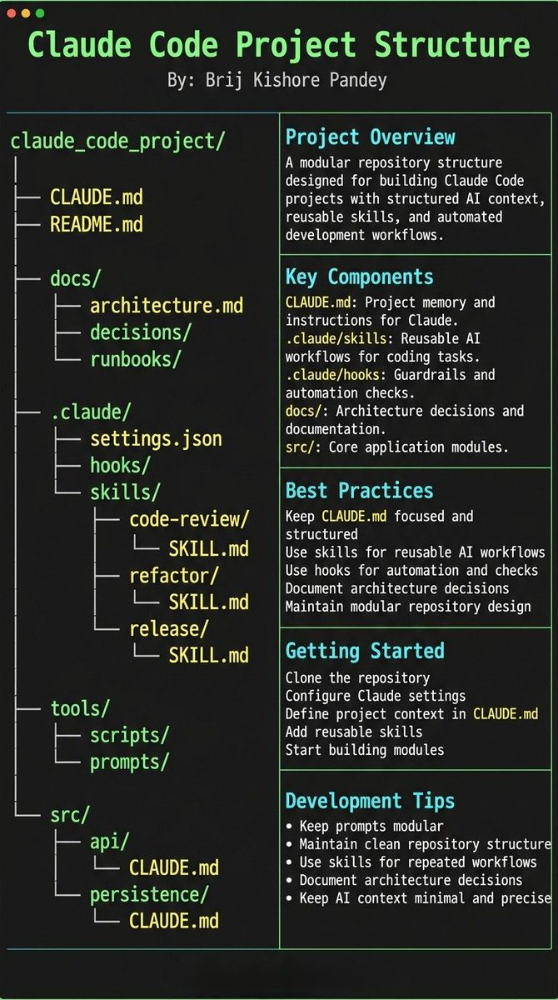

# Claude Code 프로젝트의 해부학

많은 사람이 `CLAUDE.md`를 단순한 프롬프트 파일처럼 다룹니다.

하지만 그건 흔한 실수입니다.

Claude Code를 저장소 안에서 함께 일하는 시니어 엔지니어처럼 동작하게 만들고 싶다면, 프로젝트 자체에 구조가 있어야 합니다.

Claude는 작업할 때 항상 다음 네 가지를 필요로 합니다.

- 왜: 이 시스템이 무엇을 위해 존재하는지
- 지도: 무엇이 어디에 있는지
- 규칙: 무엇이 허용되고 금지되는지
- 워크플로: 일이 어떤 방식으로 진행되는지

이 문서는 위 원칙을 바탕으로, Claude Code 친화적인 프로젝트 구조를 정리한 가이드입니다.

## 핵심 원칙

프롬프팅은 일시적입니다.

구조는 지속됩니다.

저장소가 이 방식으로 정리되어 있으면 Claude는 챗봇처럼 반응하는 대신, 프로젝트 문맥을 이해하는 엔지니어처럼 행동하기 시작합니다.

## 1. `CLAUDE.md` = 저장소의 기억(Repo Memory)

`CLAUDE.md`는 저장소의 북극성 같은 파일이어야 합니다.

중요한 것은 짧고 선명해야 한다는 점입니다. 지식을 전부 쌓아두는 저장소가 아니라, Claude가 현재 프로젝트를 이해하는 데 필요한 최소 핵심 정보만 담아야 합니다.

포함할 내용:

- 목적(Purpose): 이 저장소가 왜 존재하는가
- 저장소 지도(Repo Map): 주요 디렉터리와 책임은 무엇인가
- 규칙과 명령(Rules + Commands): 어떤 방식으로 일하고 무엇을 실행해야 하는가

너무 길어지면, 오히려 중요한 맥락을 모델이 놓치기 쉬워집니다.

## 2. `.claude/skills/` = 재사용 가능한 전문가 모드

매번 같은 지시문을 다시 쓰지 말고, 반복되는 작업 방식을 스킬로 분리해야 합니다.

예시:

- 코드 리뷰 체크리스트
- 리팩터링 플레이북
- 릴리스 절차
- 디버깅 플로우

이렇게 하면 세션이 바뀌어도 작업 방식이 흔들리지 않고, 팀원 간에도 일관된 품질을 유지할 수 있습니다.

## 3. `.claude/hooks/` = 가드레일

모델은 중요한 규칙을 잊을 수 있습니다.

하지만 훅은 잊지 않습니다.

반드시 결정적으로 보장되어야 하는 동작은 훅으로 처리하는 것이 좋습니다.

예시:

- 편집 후 자동 포매터 실행
- 핵심 변경 시 테스트 자동 실행
- `auth`, `billing`, `migrations` 같은 위험 디렉터리 차단

즉, "반드시 지켜야 하는 것"은 프롬프트가 아니라 시스템 레벨의 가드레일로 관리해야 합니다.

## 4. `docs/` = 점진적으로 불러오는 맥락(Progressive Context)

모든 정보를 프롬프트에 밀어 넣을 필요는 없습니다.

중요한 것은 "진실이 어디에 있는지"를 Claude가 알 수 있게 해두는 것입니다.

`docs/`에는 다음과 같은 문서를 두는 것이 좋습니다.

- 아키텍처 개요
- ADR(Architecture Decision Records)
- 운영 런북

이렇게 하면 필요할 때만 관련 문서를 찾아 맥락을 확장할 수 있고, 기본 프롬프트는 가볍게 유지할 수 있습니다.

## 5. 위험한 모듈에는 로컬 `CLAUDE.md` 추가

예민한 영역에는 전역 문서 하나만으로는 부족할 수 있습니다.

그럴 때는 모듈 가까이에 작은 `CLAUDE.md`를 둬서, 해당 경로에서 작업할 때만 필요한 주의사항을 바로 보이게 해야 합니다.

예시:

```text
src/auth/CLAUDE.md
src/persistence/CLAUDE.md
infra/CLAUDE.md
```

이 방식은 날카로운 경계면의 함정과 제약을 정확히 그 위치에서 노출시켜 줍니다.

## 권장 구조 예시



## 정리

`CLAUDE.md`를 프롬프트 파일로만 보면 Claude Code의 성능은 매 세션마다 흔들립니다.

반대로 저장소에 목적, 구조, 규칙, 워크플로를 명확히 배치하면 Claude는 프로젝트에 거주하는 엔지니어처럼 더 안정적으로 동작합니다.

결론은 단순합니다.

- 프롬프트는 임시적입니다.
- 구조는 영속적입니다.
- 좋은 Claude Code 경험은 좋은 저장소 구조에서 시작됩니다.

출처: [BharukaShraddha on X](https://x.com/BharukaShraddha/status/2029836408232497678)
